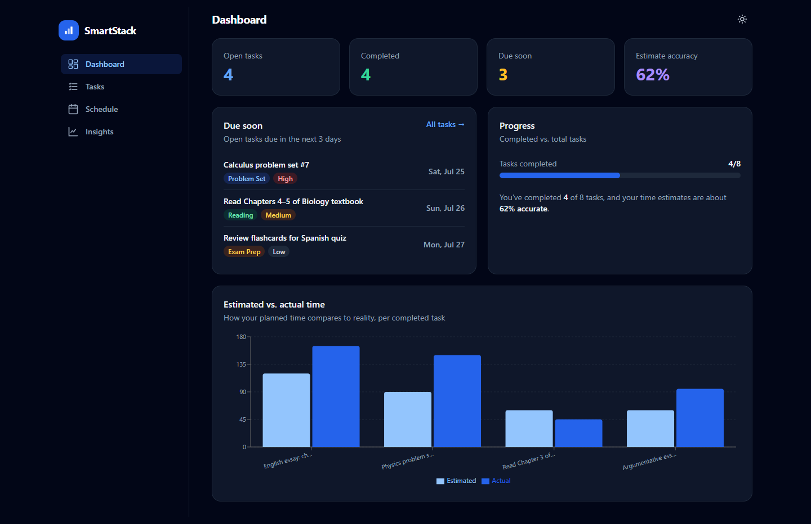
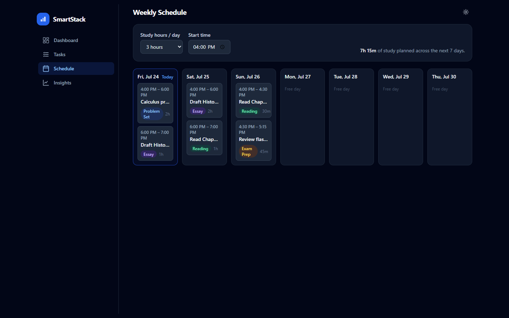
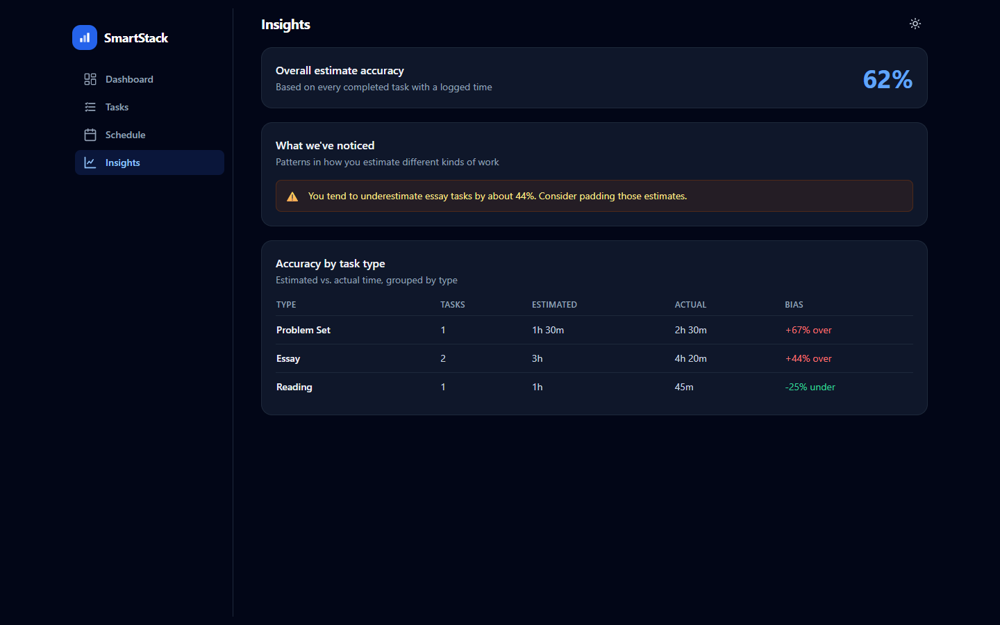

# SmartStack

A browser-based study planner that schedules a student's assignments and records how long each one *actually* takes versus how long they *estimated* it would.

**▶ Live demo: [smart-stack-green.vercel.app](https://smart-stack-green.vercel.app/)**



---

## The idea

Students are consistently bad at estimating how long schoolwork will take. SmartStack turns that weakness into data: every time you finish a task, it asks how long the task *actually* took and stores that next to your original estimate. Over time this builds a personal record of where your estimates go wrong — broken down by task type and priority.

That dataset is the point of the project. Today the app reports the error back to you as plain statistics (for example, "you underestimate essays by about 44%"). The longer-term goal is to train a duration-prediction model on the same data so the app can correct your estimates automatically. **That model is on the roadmap; it is not built yet.** The current version is the data-collection layer it would learn from.

---

## Features

- Add, edit, and delete tasks; mark a task done and log the actual minutes it took.
- A scheduler that packs open tasks into a configurable daily study budget across the next 7 days, ordered by deadline urgency and priority.
- A weekly calendar view of the generated plan.
- A dashboard with a due-soon list, task counts, a completion bar, and an estimated-vs-actual chart.
- An insights view that computes, per task type, how far your estimates miss. This is descriptive statistics over your completed tasks — not a model.
- Light and dark mode; responsive down to a phone width.
- Data persists in the browser via `localStorage`; no account or backend required.

---

### Weekly schedule

The scheduler assigns open tasks to time blocks over the next 7 days, filling each day up to the study budget you set (hours per day and a start time).



### Insights

For every task type with enough completed history, the app shows the gap between estimated and actual time — the raw signal a future prediction model would train on.



---

## Architecture

The structure follows one principle: isolate the parts most likely to change, so each future step touches as few files as possible. The decisions that matter:

- **`lib/storage.ts` is the only module that touches `localStorage`.** Every read and write goes through it. Replacing the browser store with a real backend later means rewriting this one file — the hooks, pages, and components that call it don't change.
- **The scheduler is a pure function with an injectable `today`.** `buildSchedule(tasks, options)` performs no I/O and reads no global clock; you pass the reference date in. That makes it deterministic and directly unit-testable.
- **`priorityScore()` is factored out of the scheduler.** It computes a task's urgency score from its deadline and priority. It sits alone specifically so it can later be swapped for a model-predicted score without rewriting the scheduling loop around it.
- **`lib/insights.ts` is kept separate on purpose.** It computes exactly the estimate-versus-actual error that a duration-prediction model needs as its training target. Keeping it isolated means the future model can replace its internals without disturbing the UI.
- **Dates are ISO strings throughout, never `Date` objects.** Values round-trip cleanly through JSON — into `localStorage` today and an HTTP API later — without timezone surprises.

State is shared through a small React context so every page reads one consistent copy of the tasks and settings.

```
src/
├── lib/            # Pure logic, no React — this is what the tests cover
│   ├── storage.ts      # The only module that touches localStorage
│   ├── scheduler.ts    # Greedy scheduler + priorityScore (pure, injectable date)
│   ├── insights.ts     # Estimate-vs-actual statistics (future ML training signal)
│   └── dates.ts        # ISO-string date helpers
├── hooks/          # React state layered over lib/ (useTasks, useSettings, useTheme)
├── context/        # Shared task + settings store
├── components/     # Reusable UI, with ui/ primitives (Card, Button, Modal, …)
├── pages/          # Dashboard, Tasks, Schedule, Insights
└── types/          # Domain types — the single source of truth for data shapes
```

---

## Testing

30 unit tests run with [Vitest](https://vitest.dev/), covering the two pure modules where the real logic lives:

- **`scheduler.ts`** — priority scoring (sooner deadlines and higher priority rank first; overdue handling; ties), and `buildSchedule` (deterministic output for a fixed date, respects the daily budget, excludes completed tasks, and splits a task across days when it doesn't fit in one).
- **`insights.ts`** — estimate-vs-actual math grouped by task type, correct handling of zero completed tasks, and no division-by-zero on empty or zero-estimate input.

```bash
npm run test:run    # run once
npm test            # watch mode
```

One scheduler test documents a **known limitation rather than hiding it**: when total open work exceeds the 7-day capacity, `buildSchedule` schedules up to capacity and silently drops the remainder, with no signal in the return value. The test asserts that current behavior, and the gap is tracked in [issue #1](https://github.com/SuhaasMandava/Smart-Stack/issues/1). A documented limitation with a test proving it is deliberate — the fix will update the test to assert the new behavior.

---

## Roadmap

| Phase | Scope | Status |
|---|---|---|
| **1 — Task management** | Task CRUD, `localStorage` persistence, seed data | ✅ Complete |
| **2 — Scheduling & insights** | Greedy scheduler, weekly view, dashboard, estimate-vs-actual statistics | ✅ Complete |
| **3 — Quality & deployment** | 30 unit tests, CSP + security headers, live on Vercel | ✅ Complete |
| **4 — ML duration predictor + FastAPI backend** | Train a model on the collected estimate/actual data to predict task duration; move persistence behind a Python API | ⬜ Not started |
| **5 — Calendar-feed integrations** | Import deadlines from Google Calendar, Canvas, and Infinite Campus | ⬜ Planned |
| **6 — Accounts & cross-device sync** | User accounts and syncing data across devices via the backend | ⬜ Planned |

Phase 4 is where machine learning enters the project. It has not been started — the current app collects and displays the data that phase would use.

---

## Running locally

Prerequisites: **Node 18+** and npm.

```bash
npm install     # install dependencies
npm run dev     # start the dev server at http://localhost:5173
npm run build   # type-check and build to dist/
```

---

## Security

SmartStack is a fully static single-page app with no backend, no authentication, and no outbound network calls, so the main hardening surface is the HTTP response headers. They are defined in [`vercel.json`](vercel.json) (authoritative for production) and mirrored into `vite.config.ts` under `preview.headers` so `npm run preview` reproduces the same policy locally.

| Header | Purpose |
|---|---|
| **Content-Security-Policy** | Restricts where scripts, styles, images, and connections may load from — the primary defense against XSS. |
| **X-Frame-Options: DENY** | Blocks framing (clickjacking); reinforced by CSP `frame-ancestors 'none'`. |
| **X-Content-Type-Options: nosniff** | Prevents MIME-sniffing responses into an unexpected type. |
| **Referrer-Policy: strict-origin-when-cross-origin** | Avoids leaking full paths in the referrer header. |
| **Permissions-Policy** | Denies camera, microphone, and geolocation — APIs the app never uses. |

The CSP is strict: `default-src 'self'`, no cross-origin `connect-src`, `object-src 'none'`. The one inline script (the pre-paint theme setter in `index.html`) is allow-listed by its exact **sha256 hash** rather than `'unsafe-inline'` — recompute the hash if that script changes. `style-src` keeps `'unsafe-inline'` as a single deliberate exception, because Recharts writes inline `style` attributes on the SVG elements it renders. The policy was verified in headless Chrome across every route, the chart, and the theme toggle with zero CSP violations.

---

## License

MIT — see [LICENSE](LICENSE). © 2026 Suhaas Mandava.
